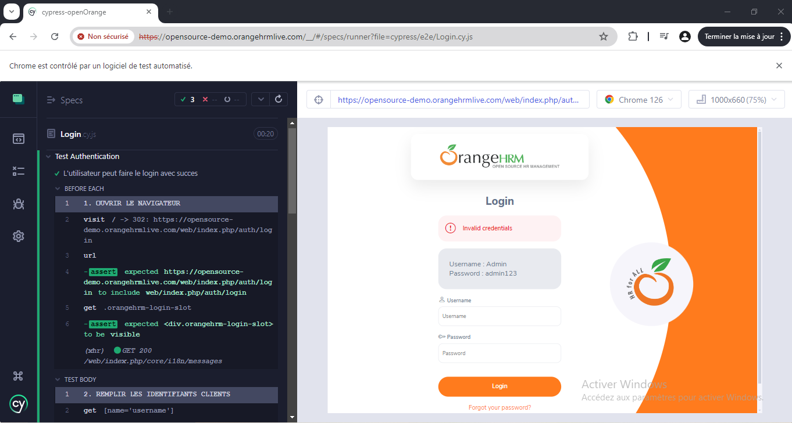

# cypress-qa-demo

### 💻 Topics

We reviewed topics like:
1. 'main' Branch:
 
- ## 💻 Pre-requisites

Before you use this project you only need to have Node Js installed in your computer.

https://nodejs.org/es/download/

## 🚀 Install the project

Install project dependencies with: npm i

### Headless mode

Run `npm run cy:open` To launch the test cases by opening the browser locally.

Run `npm run e2e:run` To launch the test cases and generate a report.

### Interactive mode

1. Run `npm run cy:open` to open the Cypress App;
2. Select E2E Testing;
3. Select one of the available browsers (e.g., Electron), and click the Start button;
4. **Run the [`cypress/e2e/gui/Login.cy.js`](./cypress/e2e/Login.cy.js) test;**
5. Finally, click on the test file you want to run and wait for it to finish.

#### Example

Here's an example of running all the GUI tests in interactive mode.

